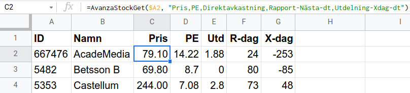
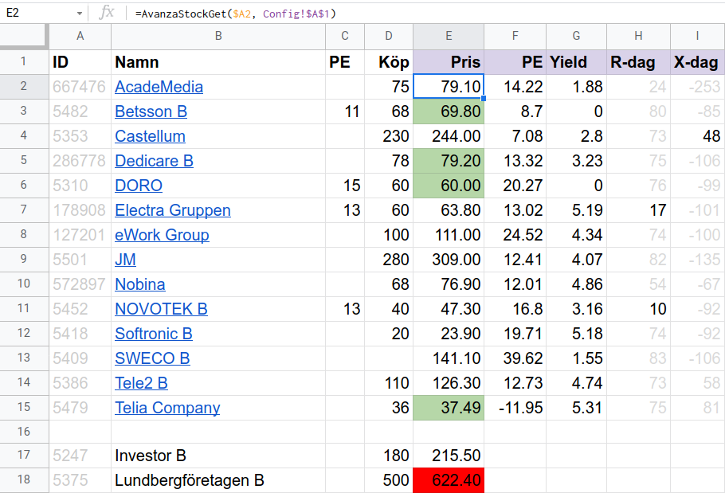

# Avanza
Demonstration av hur Avanzas (icke-officiella) API kan användas
inifrån Google Sheets för att hämta färsk aktie- och fond-information
m.h.a. de nya formlerna [AvanzaStockGet](#avanzastockget) och [AvanzaFundGet](#avanzafundget).

NB! Koden är endast avsedd för demo-syften. Felhantering saknas helt.

Jag har inga kopplingar till Avanza annat än som nöjd kund.

## Exempel
Såhär kan det se ut:

Kolumnerna `ID` och `Namn` är manuellt ifyllda, resterande kommer från
Avanza via formeln [AvanzaStockGet](#avanzastockget). Notera den komma-separerade
strängen `"Pris,PE,[...]"`, detta anger vilken information som hämtas.

Ett mer avancerat exempel som använder "Conditional formatting" för
att framhäva viktiga värden och skymma mindre viktiga värden:

Kolumnerna `ID`, `Namn`, `PE` och `Köp` är manuellt ifyllda, resterande kommer
från Avanza. Namnen på vissa aktier visas i blått därför att de länkar
till aktiernas hemsidor på Avanza. Cellerna i kolumnen `Pris` visas med
olika bakgrundsfärg beroende på hur `Pris` förhåller sig till `Köp`, tack
vare "Conditional formatting". Notera `Config!$A$1` i formeln högst upp,
som betyder att informationen som ska hämtas finns i cell `A1` i det
Sheet som har namnet `Config`.

##  Uppsättning
För att få tillgång till de nya formlerna, kopiera innehållet i filen
[AvanzaApiDemo.gs](https://raw.githubusercontent.com/proschinger/avanza/main/AvanzaApiDemo.gs) till en ny skript-fil i Apps Script:

1. Inifrån ett Google Sheets dokument, klicka på Tools - Script
   Editor. Detta öppnar Apps Script.
2. Klicka på `+` tecknet till höger om Files och välj Script i
   dialogrutan som dyker upp.
3. Ange ett godtyckligt filnamn, t.ex. <kbd>Avanza</kbd>, och tryck på <kbd>ENTER</kbd>.
4. Den nya skript-filen har lite för-ifyllt innehåll som behöver tas
   bort, exempelvis med <kbd>Control+a</kbd> följt av <kbd>Delete</kbd>.
5. Kopiera innehållet i filen [AvanzaApiDemo.gs](https://raw.githubusercontent.com/proschinger/avanza/main/AvanzaApiDemo.gs) till skript-filen och
   spara med <kbd>Control+s</kbd>.
6. Klart.

Tips: För att anpassa hur ofta formlerna "räknas om", gå till File -
Spreadsheet settings - Calculation - Recalculation.

## Användning
Efter uppsättning kan följande nya formler användas:

- [AvanzaStockGet](#avanzastockget)
- [AvanzaFundGet](#avanzafundget)

### AvanzaStockGet()
Formeln tar två parametrar:

- Parameter 1: Aktie-ID. Ett heltal som identifierar aktien hos
  Avanza. Hittas genom att besöka aktiens hemsida på Avanza och
  kopiera dess ID från URL:en. Exempelvis `5479` för [Telia Company](https://www.avanza.se/aktier/om-aktien.html/5479/telia-company).
- Parameter 2: Eftersökt information. En komma-separerad sträng som
  anger vilken information som ska hämtas. Exempelvis `"Pris,PE"`
  hämtar aktiekursen och PE.

Aktie-information som kan hämtas via parameter 2:

- **Pris**: Aktiekurs, anges i **Valuta**.
- **Utdelning**: Nästa utdelning, anges i **Valuta**.
- **Utdelning-Xdag**: Datum för nästa utdelnings X-dag.
- **Utdelning-Xdag-dt**: Antal dagar till nästa utdelnings X-dag.
- **PE**: PE.
- **Direktavkastning**: Direktavkastning i %.
- **Rapport-Nästa**: Datum för nästa rapport.
- **Rapport-Nästa-dt**: Antal dagar till nästa rapport.
- **Valuta**: Valuta för **Pris** och **Utdelning**.

Exempel:

    =AvanzaStockGet(5479, "Pris,PE")

### AvanzaFundGet()
Formeln tar två parametrar:

- Parameter 1: Fond-ID. Ett heltal som identifierar fonden hos Avanza.
  Hittas genom att besöka fondens hemsida på Avanzas och kopiera dess
  ID från URL:en. Exempelvis `2801` för [AMF Aktiefond Småbolag](https://www.avanza.se/fonder/om-fonden.html/2801/amf-aktiefond-smabolag).
- Parameter 2: Eftersökt information. En komma-separerad sträng som
  anger vilken information som ska hämtas. Exempelvis `"NAV,Valuta"`
  för att hämta fondens NAV och Valuta.

Fond-information som kan hämtas via parameter 2:

- **NAV**: Fondens NAV, anges i **Valuta**.
- **Valuta**: Valuta för **NAV**.

Exempel:

    =AvanzaFundGet(2801, "NAV,Valuta")

## LICENS
MIT licens. Se filen [LICENSE](./LICENSE) för detaljer.